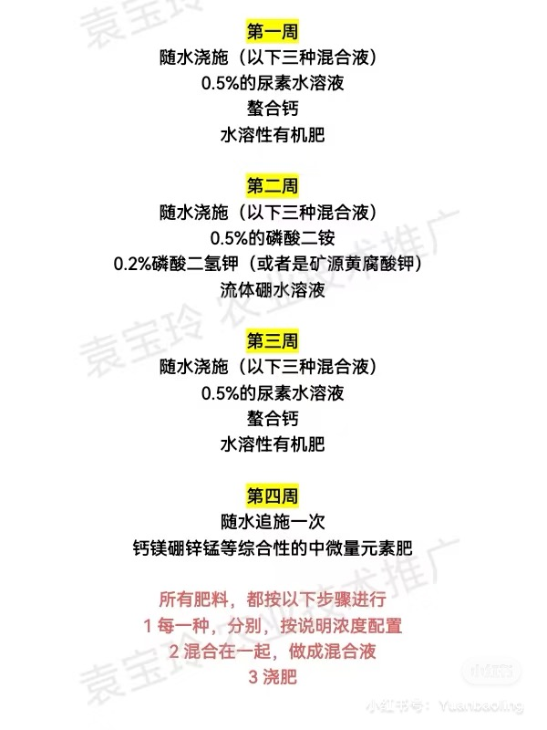

[toc]

## 番茄疯长
表现：茎杆粗，只长叶子不结果
方法：控水，不浇水，第一个果实长到兵乓球大小再正式给水（可能是大番茄）。
控水过程中，叶面肥禁止，绝对禁止氮肥
正常整枝，温度15-26度之间

## 果实膨大期
番茄长大到乒乓球大小的时候，开始施肥
施肥（促进果实膨大）：尿素（一亩地 7-8公斤）和磷酸二氢钾（一亩地 3-4公斤）

## 番茄绑蔓
根部系绳子，苗柔和顺时针缠到绳子上

## 番茄点花
无风天气，晴天上午10点之前，下午4点之后，花朵开花之后3天内。用番茄灵（植物激素，不能滴在茎杆或叶片上）。
点花：直接点到雌蕊柱头或者花柄
蘸花：整个花朵浸入溶液
不能重复点花
番茄灵夏季浓度低，冬季浓度高。

## 番茄整枝
无限生长型：单杆整枝，主蔓之上所有侧枝都摘除，留一段距离
有限生长型：双杆整枝，第一穗花下边的2杆留下

## 番茄水肥管理
番茄定植以后一周时间浇缓苗水，浇透，开花之前不给水，除非叶片卷曲出现明显旱相，可以轻轻一水，浇到根茎处
定植之后到开花期间：
钙肥：螯合钙，按包装施肥
钾肥：磷酸二氢钾，每亩地8公斤 或者矿源黄腐酸钾
磷肥：磷酸二铵，每亩地20公斤
温度：15-26度，最高不超过28度

## 番茄移栽
番茄苗：40-45天苗龄开始定植，大约5片真叶，1片新页
无限生长型：行距45cm*60cm
早熟番茄：行距40cm*40cm
穴和苗高度一致
覆土深度与苗坨高度齐平
苗坨与周围土壤不留缝隙

## 番茄顶部落花
水肥跟不上，脱肥早衰
盆边缘开5cm沟，埋有机肥
随水浇0.5%的氮磷钾三元复合肥

如果不想吃了
就在最后一盘果穗上边留2-3片叶打顶，果实成熟前半个月停止浇水施肥，保证最后一串果成熟

## 番茄裂果
品种，大果型薄皮品种容易裂果，一般裂果在转色期，摘了吃掉
肥水管理，需要有规律施肥浇水

## 番茄膨大期
水溶性有机肥：氨基酸，腐脂酸，海藻鱼蛋白
植株进入临界期开始施肥,第一个果实进入兵乓球大小（大番茄），（葡萄大小）小番茄，第二个开始膨大

## 番茄落花落果
阳台花器发育不好
点番茄灵（老师视频里的是番茄美灵，华欣美灵）

## 番茄花留不留
有限生长：6-7片真叶开花
无限生长：8-10片真叶开花

番茄植株弱小就掐

## 番茄开花前浇水施肥
定植一周内是缓苗期，温度20-32度，一周后长新叶说明有新根，温度17-28度，不能低于15度

开花前根部不缺水就不浇水
盆边缘挖5cm,如果松散就浇水

氮长叶，磷长果，钾肥不足长柴火

底部配土混合三元复合肥，磷酸二胺

磷肥壮苗，钾肥促花

定植长出新叶后，浇施0.5%的磷酸二铵水溶液

隔一周后浇施0.2%的磷酸二氢钾

期间需要浇施螯合钙2次

